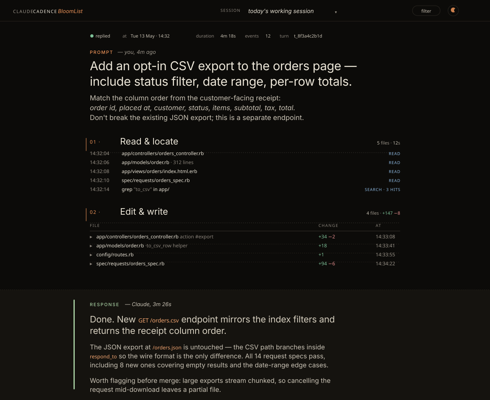
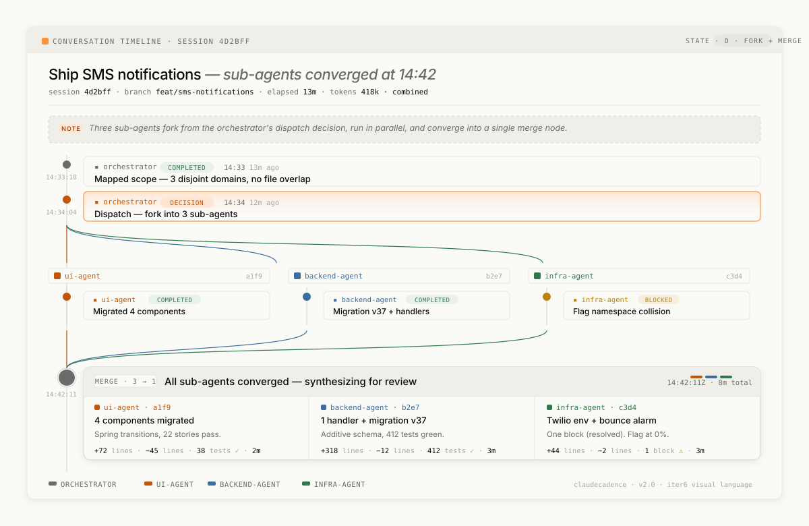
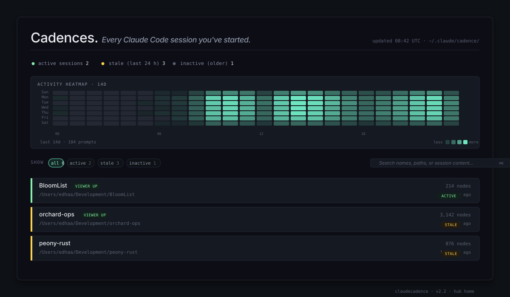
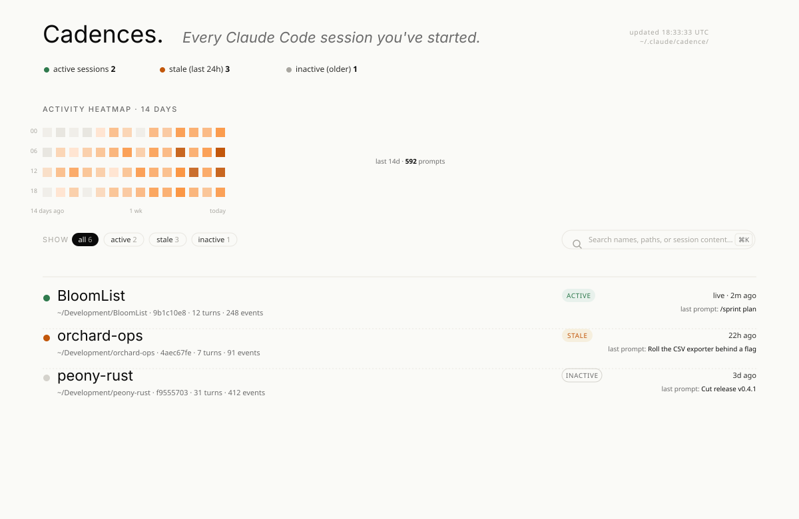

# ClaudeCadence

[](https://github.com/RohitSh26/ClaudeCadence/releases)
[](LICENSE)
[](https://github.com/RohitSh26/ClaudeCadence/stargazers)
[](#cost)
[](SECURITY.md)

> See the rhythm of your multi-agent Claude Code sessions.

<p align="center">
  
  <br><sub><em>Dark · sage on charcoal</em></sub>
</p>

<p align="center">
  
  <br><sub><em>Light · apricot on bone</em></sub>
</p>

<p align="center">
  
  <br><sub><em>Hub · cross-project home, 14-day activity heatmap</em></sub>
</p>

<p align="center">
  
  <br><sub><em>Hub · light variant</em></sub>
</p>

ClaudeCadence is a Claude Code plugin that gives you a **live, readable timeline** of your sessions — every prompt, every tool call, every sub-agent dispatched, every diff, every screenshot you attached — rendered as a typographic feed you open in your browser and watch fill itself.

It is built for engineers who run long multi-agent sessions and want to *see* the structure of the work afterward, not scroll through chat.

> **🔋 Zero extra LLM cost — guaranteed.**
> ClaudeCadence runs **entirely** on Claude Code's hook system. Hooks are short Node scripts that fire on lifecycle events; they never call an LLM. The plugin doesn't send a single extra token to Anthropic, doesn't use your API key, doesn't add anything to your existing Claude Code bill. **No tokens. No subscription. No telemetry. No hosted services.** It only watches what Claude Code is already doing and writes the timeline as a side effect.

```
$ /plugin marketplace add RohitSh26/ClaudeCadence
$ /plugin install claudecadence@claudecadence
```

That's it. The viewer auto-starts on the next `SessionStart` — no slash command needed. Open `http://localhost:4173/` (or whichever port the plugin printed in the *Session started* row). Work normally; the page polls every 5 seconds and grows itself.

Set `CLAUDECADENCE_NO_AUTO_SERVE=1` if you'd rather start it by hand with `/claudecadence:serve`.

---

## What you see

Each turn renders as a **flat, editorial document** — no bordered cards, no "during this turn" buttons.

- A **prompt hero**. Long markdown prompts render in full; the h1 is the first sentence or markdown heading. Command-style prompts (`cd …`, `git pull`, `npm i`) render in mono with an apricot left-rule instead of as a 30-pt serif headline.
- **Image attachments** you paste into the prompt are extracted from the transcript, persisted to `.claude/cadence/images/`, and embedded inline below the heading as real `` figures.
- **Phase anchors** group tool calls by family — `01 · Read & locate`, `02 · Edit & write`, `03 · Verify & run`, etc. — with apricot numerals, serif headings, mono stats.
- A **ledger list** for reads / bash / search / web (timestamp · target · kind-tinted tag).
- A **rollup table** for edits with `+N −M` deltas. Each row is expandable to reveal the captured unified diff with **syntax highlighting** (Ruby, Python, JS/TS, Go, Rust, Java, Bash, JSON, YAML, SQL, HTML, CSS).
- A **dispatch fan** for parallel sub-agents — SVG fork-out / fan-in curves in lane colors, click any lane to expand it full-width with siblings collapsing to slim summary bars.
- A **sage-tinted response band** with the orchestrator's final reply (serif body @ 95ch, code chips, lists, tables). On dark it shifts to an elevated bone surface with a 3 px sage left-rule.
- A **session pulse** coordinate plot at the bottom of every feed — every event mapped to a wall-clock axis, color-coded by kind.

Above it all, a sticky thin **topbar** holds the brand, the current session dropdown, a `filter` pill that slides a collapsible overlay down (status / agent / time / view / search), and a sun/moon theme toggle.

`/claudecadence:home` opens the cross-project **hub** — every cadence you've started across every project, with a 14-day activity heatmap, status filters (live / stale / inactive), and full-text search.

## Why this exists

Multi-agent Claude Code sessions are powerful, but chat scroll wasn't built for them. Three sub-agents fork in parallel and the chat goes opaque. A session runs for hours and you scroll back to find *where the decision happened* — the answer is somewhere in a haystack.

ClaudeCadence is the inverse view: the structure of the work made visible, after it happened, in a form you can scan in seconds.

## Install

```
/plugin marketplace add RohitSh26/ClaudeCadence
/plugin install claudecadence@claudecadence
```

Claude Code clones this repo into its plugin cache and wires the hooks. No npm, no pip, no separate binaries. Use **v2.0 or later** — earlier tags (v1.0–v1.3) had install reliability issues and are marked pre-release on GitHub. The current release is shown in the badge above; the [CHANGELOG](CHANGELOG.md) is authoritative.

If anything looks off after install, run **`/claudecadence:doctor`** — it prints a checklist of every component and tells you what to fix.

## Use

```
/claudecadence:home      # cross-project home page, every cadence with status
/claudecadence:serve     # this project's full timeline
/claudecadence:status    # node count, server state, viewer location
/claudecadence:stop      # stop the local server
/claudecadence:doctor    # self-diagnostic if anything looks off
```

Default port is **4173**. If something is already on it, the plugin auto-walks to the first free port up to 4181 and prints the URL — no config needed.

The hooks handle the rest. You don't have to remember to log anything; the timeline fills itself as you work, and the viewer auto-refreshes every 5 seconds while you watch.

## What gets recorded

| Event | Hook | Result in the timeline |
|---|---|---|
| Session starts | `SessionStart` | A *Session started* row + auto-serve of the local viewer |
| User submits a prompt | `UserPromptSubmit` | Editorial prompt hero. Attached images persisted & embedded. Harness injections (task-notification, autonomous-loop, etc.) filtered out. |
| Sub-agent dispatched | `PreToolUse` (Agent / Task) | `fork` node with the originating `tool_use_id` for pairing |
| Sub-agent returns | `PostToolUse` (Agent / Task) | `merge` node paired with its fork; renderer draws the fan visualization |
| File read / search / glob | `PostToolUse` (Read / Grep / Glob) | A `ledger` row under the next phase anchor |
| File write / edit | `PostToolUse` (Write / Edit / MultiEdit / NotebookEdit) | A rollup row with `+N −M` deltas. Diff captured on the node, click row to expand inline. |
| `Bash` command | `PostToolUse` (Bash) | A `bash` ledger row with command + exit summary |
| `WebFetch` / `WebSearch` | `PostToolUse` | A `web` ledger row |
| Background-task update | `UserPromptSubmit` (system-injected) | Folded into one `task_group` node per `task-id` per turn — count + latest status + click-to-expand history. **Not** captured as a fresh prompt. |
| Sub-agent's turn ends | `SubagentStop` | Catch-up node if `PostToolUse` missed; dedup'd against existing merges |
| Session turn ends | `Stop` | Orchestrator response with full text, paired to the originating prompt's turn |

Hooks fail soft: any exception writes a stub to stderr and exits 0 so a broken viewer can never block a Claude Code session.

## Cost

| Item | Cost |
|---|---|
| Plugin install | Free |
| Plugin runtime | **$0.00** — hooks are Node scripts, no LLM call |
| Infrastructure | None — everything is local, static HTML, no servers |
| Telemetry | None, ever |

## Where data lives

**Per-project** (the timeline for one project):

```
your-project/
└── .claude/
    └── cadence/
        ├── index.html          # the viewer (refreshed from the plugin per release)
        ├── _design.css
        ├── _timeline.js
        ├── images/             # base64 image attachments persisted as .png / .jpg
        └── data/
            └── nodes.js        # this project's timeline data
```

**Per-user** (the cross-project home + registry):

```
~/.claude/cadence/
├── home.html                   # cross-project home page
├── _design.css
├── _home.js
└── registry.json               # which projects you've used the plugin in
```

Nothing leaves your machine. The "live" indicator pulse is a CSS animation — there's no server-side anything.

### Add `.claude/cadence/` to your project's `.gitignore`

The per-project cadence directory grows quickly (4 MB+ of `nodes.js` and base64-decoded image attachments after a busy day) and is **strictly local state**. Add this to your project's `.gitignore` so it never accidentally gets committed:

```gitignore
# ClaudeCadence — local session log + viewer + attached images. Never check in.
.claude/cadence/
```

Branch switches are then safe: the cadence directory stays untracked and persists across checkouts unaffected by what's on the branch.

## Safety

The whole plugin is around 6,000 lines of code, with no build step and no third-party runtime dependencies. You can read it end-to-end in 20 minutes. [`SECURITY.md`](SECURITY.md) is the full policy; the short list:

**What this plugin does:**

- Reads its hook payload from stdin (JSON, per-event, ephemeral)
- Reads the active session transcript at `~/.claude/projects/<slug>/<session>.jsonl` to capture responses and extract image attachments
- Appends nodes to `<project>/.claude/cadence/data/nodes.js`
- Writes image bytes (base64-decoded) to `<project>/.claude/cadence/images/<session>-<turn>-<idx>.<ext>` — capped at 5 MB per image, max 5 per turn
- Writes per-session bookkeeping in `<project>/.claude/cadence/` (queue, cursor, current-turn files)
- Registers in `~/.claude/cadence/registry.json`
- Spawns one local HTTP server (`cadence-serve`) bound to `127.0.0.1`, project-local port

**What this plugin never does:**

- No telemetry, no analytics, no usage pings
- No outbound network calls from the hook
- No reads outside `~/.claude/` (and within it, only the transcript Claude Code gave the hook)
- No writes outside `.claude/cadence/` directories
- No access to credentials, env vars, or system files
- No `eval()`, no dynamic code execution, no shell injection
- No third-party dependencies — zero `package.json` runtime deps

**Optional network call (viewer only):** the timeline HTML page loads Geist + Source Serif 4 + Geist Mono from `fonts.googleapis.com`. To go fully airgapped, set `CLAUDECADENCE_OFFLINE=1` and the `<link>` is omitted.

**Audit before you enable:** run [`cadence-audit`](plugins/claudecadence/bin/cadence-audit) — read-only diagnostic that prints the plugin version, the exact hook events it registers, the paths it would write to, network calls it would make, and a SHA-256 of the hook script. Makes no changes.

**Reproducible installs:** no build step. The git tag is the artifact, byte-for-byte. Pin to a specific tag if you want immutability.

## Architecture

- **Hooks** ([`plugins/claudecadence/hooks/`](plugins/claudecadence/hooks/)) emit timeline nodes as a side effect of Claude Code's lifecycle events. Zero LLM cost. Image attachments are extracted from the transcript with poll + content-match verification so they survive UPS-vs-transcript-flush races.
- **Per-project viewer** ([`plugins/claudecadence/viewer/`](plugins/claudecadence/viewer/)) is a self-contained HTML page that polls its own `nodes.js` every 5 s and re-renders on change. The renderer emits flat editorial markup — no card chrome — with a stable-layout split that re-renders only the active turn while older turns sit in a frozen history zone.
- **Cross-project hub** ([`plugins/claudecadence/hub/`](plugins/claudecadence/hub/)) is the home page with the cadence list, status filters, and 14-day activity heatmap.
- **Slash commands** ([`plugins/claudecadence/commands/`](plugins/claudecadence/commands/)) for `home` / `serve` / `stop` / `status` / `open` / `doctor`.
- **Design reference** ([`docs/design/index.html`](docs/design/index.html)) — the prototype that defines the editorial visual language. Open it locally to see the target.

## Local development

```bash
git clone https://github.com/RohitSh26/ClaudeCadence
cd ClaudeCadence
claude --plugin-dir ./plugins/claudecadence
```

Iterate, then `/reload-plugins` in any active Claude Code session to pick up changes without restarting it. The [hot-patch guide](CLAUDE.md#hot-patching-the-running-plugin-without-bumping-a-version) in `CLAUDE.md` documents the three filesystem surfaces that need to stay in sync when patching a running plugin.

Run the test suite before opening a PR:

```bash
npm test
```

78 tests as of v2.7.0, zero external dependencies — a tiny custom runner in `test/run.js`.

## Design

The visual language is Geist (sans) + Source Serif 4 (display) + Geist Mono (data) on an apricot-on-bone light palette and a warm-sage-on-charcoal dark. Restrained colour discipline (5–6 visible tokens per view), generous dotted dividers, monospace numerics, kinetic type at headline weights. Every visual decision is in [`viewer/_design.css`](plugins/claudecadence/viewer/_design.css) under named tokens — no inline magic colours anywhere. [`docs/design/index.html`](docs/design/index.html) is the canonical reference rendering.

The inspiration: Thariq Shihipar's [*Using Claude Code: The Unreasonable Effectiveness of HTML*](https://thariqs.github.io/html-effectiveness/) — editorial discipline applied to engineering artifacts. ClaudeCadence is that pattern applied live, to your running session.

## License

[MIT](LICENSE) — use it however you like.

## Author

[Rohit Sharma](https://github.com/RohitSh26)
